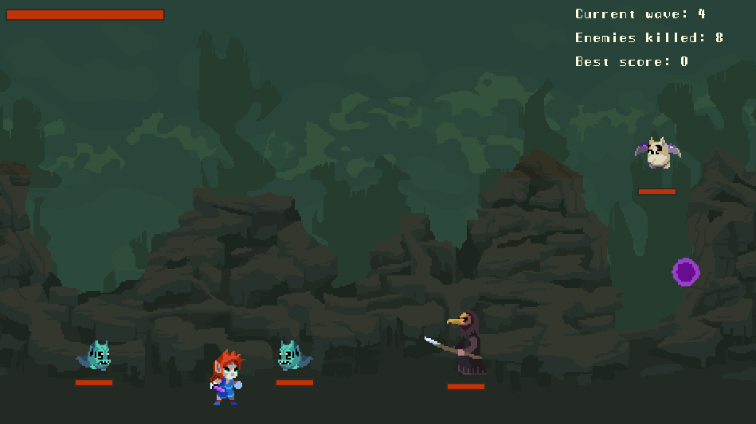

## Project overview

This project was initially inspired by the tutorial series from [Coding With Russ](https://www.youtube.com/playlist?list=PLjcN1EyupaQnvpv61iriF8Ax9dKra-MhZ) on Youtube, creating a Final Fantasy style RPG battle game with Pygame.

It was a simple turn-based combat game where a cute red-haired hero faces pairs of random enemies in a gloomy cavern setting.

But... The game wasn't that fun.

Turns out I'm not that expert into turn-based combat either, so I went for a different type of gameplay instead.

Here comes **Cavern Brawl**, a hack and slash where waves of enemies will keep coming at you until you lay dead on the cavern floor. Beat them all up to reach the highest score!

### Resources

All assets used so far for this game come from [Szadiart's platformer set](https://szadiart.itch.io/rocky-world-platformer-set).

### Requirements

Requirements for using this code are available in the `requirements.txt` file.

Each package can be installed using the Pip command, or in conda with:

`conda create --name <env> --file requirements.txt`

### Run the game

Open the command line and navigate to the folder containing `main.py`

Then simply type:

`python main.py`

**Controls:**

- Q - S: move left and right
- SPACE: jump
- Left mouse: melee attack
- Right mouse: Ranged attack

## What I learned

The aim of this project was to experiment further with Python's classes and inheritance.

It started as a one evening code-along session, learning the basics of Pygame (events, game loop, sprites and animations...).

Then with the core set of classes and mechanics in place in a single file by the end of the tutorial, I first worked on improving the structure of the code, creating a minimal and reusable game engine for later Python projects.

## What's next?

There is so much I want to experiment with Pygame now that I got the hang of it. Here is a list of possible upcoming improvements to the game:
- Difficulty management as the game progresses
- Boss spawn and mechanics
- Perks and special abilities (double jump, dash, you name it)
- A more personal touch to aesthetics and sounds

